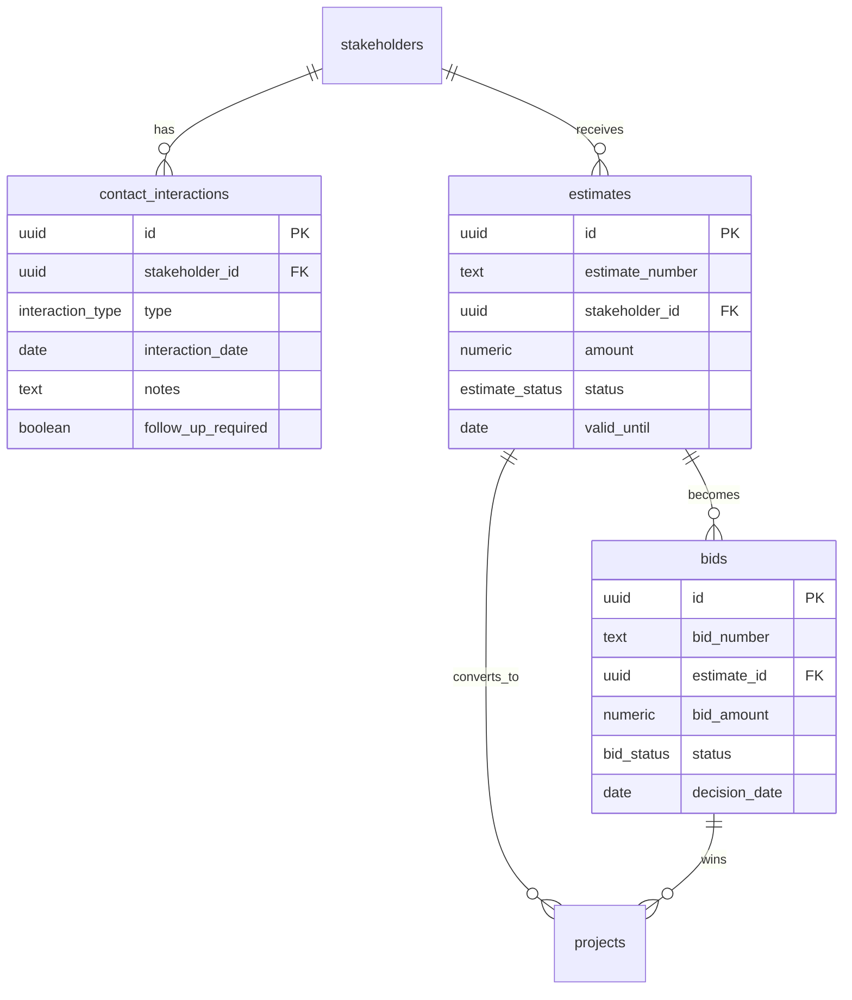

# Database Schema Documentation

## Executive Summary

This document provides comprehensive documentation for the construction project management database built on Supabase PostgreSQL. The schema supports a full-featured construction management system with user authentication, project lifecycle management, task coordination, stakeholder relationships, equipment tracking, safety compliance, and financial oversight.

**Database Stats:**
- **Tables:** 56 core tables
- **RLS Policies:** 277+ security policies
- **Functions:** 25+ custom database functions
- **Triggers:** 30+ automated triggers
- **Indexes:** 120+ performance indexes
- **Custom Types:** 15+ enum types

## Table of Contents

1. [Database Overview](#database-overview)
2. [Custom Types & Enums](#custom-types--enums)
3. [Core Tables](#core-tables)
4. [Table Relationships](#table-relationships)
5. [Row Level Security (RLS) Policies](#row-level-security-rls-policies)
6. [Database Functions & Triggers](#database-functions--triggers)
7. [Indexes & Performance](#indexes--performance)
8. [Migration History](#migration-history)
9. [Performance Considerations](#performance-considerations)

## Database Overview

### Architecture Principles

- **Security First:** Row Level Security (RLS) enabled on all tables
- **Multi-tenant:** Company-based access control with external stakeholder support
- **Audit Trail:** Comprehensive activity logging and change tracking
- **Real-time:** Optimized for real-time updates using Supabase subscriptions
- **Performance:** Strategic indexing for complex queries and large datasets

### User Roles & Permissions


### Data Access Model

- **Company Users:** Full access to internal data with role-based restrictions
- **External Users:** Limited access to assigned projects and tasks
- **Domain-based Auto-approval:** Company email domains get automatic approval
- **Multi-project Access:** Users can be assigned to multiple projects with different roles

## Custom Types & Enums

### User Management

```sql
-- User roles enum
CREATE TYPE user_role AS ENUM (
  'admin', 
  'project_manager', 
  'site_supervisor', 
  'worker', 
  'stakeholder', 
  'client', 
  'vendor'
);

-- Account status
CREATE TYPE account_status AS ENUM (
  'pending', 
  'approved', 
  'suspended', 
  'rejected'
);
```

### Project Management

```sql
-- Project status
CREATE TYPE project_status AS ENUM (
  'planning', 
  'active', 
  'on-hold', 
  'completed', 
  'cancelled'
);

-- Lifecycle status (legacy)
CREATE TYPE lifecycle_status AS ENUM (
  'pre_planning',
  'planning_active', 
  'construction_active',
  'punch_list_phase',
  'project_closeout',
  'project_completed',
  'construction_hold',
  'project_cancelled'
);

-- Unified lifecycle status (current)
CREATE TYPE project_lifecycle_status AS ENUM (
  'pre_construction',
  'mobilization',
  'construction', 
  'punch_list',
  'closeout',
  'warranty',
  'on_hold',
  'cancelled'
);
```

### Business Operations

```sql
-- Stakeholder types
CREATE TYPE stakeholder_type AS ENUM (
  'employee',
  'contractor', 
  'vendor',
  'client',
  'inspector',
  'engineer'
);

-- Contact interaction types
CREATE TYPE interaction_type AS ENUM (
  'call',
  'email', 
  'meeting',
  'site_visit',
  'other'
);

-- Estimate & bid statuses
CREATE TYPE estimate_status AS ENUM (
  'draft',
  'sent', 
  'viewed',
  'accepted',
  'rejected',
  'expired'
);

CREATE TYPE bid_status AS ENUM (
  'pending',
  'submitted',
  'won',
  'lost',
  'cancelled'
);
```

## Core Tables

### User Management & Authentication

#### profiles
**Purpose:** Extended user information beyond Supabase auth
| Column | Type | Constraints | Description |
|--------|------|-------------|-------------|
| id | uuid | PK, FK to auth.users | User identifier |
| email | text | NOT NULL | User email address |
| full_name | text | | Display name |
| role | user_role | DEFAULT 'worker' | User role in system |
| is_company_user | boolean | DEFAULT false | Company vs external user |
| account_status | text | DEFAULT 'pending' | Account approval status |
| phone | text | | Contact phone number |
| company | text | | Company/organization name |
| skills | text[] | DEFAULT '{}' | User skill tags |
| auto_approved | boolean | DEFAULT false | Auto-approved by domain |
| avatar_url | text | | Profile image URL |
| invited_by | uuid | FK to profiles.id | Who invited this user |
| last_login | timestamptz | | Last login timestamp |
| created_at | timestamptz | DEFAULT now() | Account creation |
| updated_at | timestamptz | DEFAULT now() | Last profile update |

**RLS Policies:**
```sql
-- Users can view their own profile
CREATE POLICY "Users can view own profile" ON profiles
FOR SELECT USING (id = auth.uid());

-- Users can update their own profile  
CREATE POLICY "Users can update own profile" ON profiles
FOR UPDATE USING (id = auth.uid()) WITH CHECK (id = auth.uid());
```

#### user_invitations
**Purpose:** Manage user invitation workflow
| Column | Type | Constraints | Description |
|--------|------|-------------|-------------|
| id | uuid | PK | Invitation identifier |
| email | text | NOT NULL | Invited email address |
| role | user_role | NOT NULL | Assigned role |
| invited_by | uuid | FK to auth.users | Who sent invitation |
| project_id | uuid | FK to projects.id | Associated project (optional) |
| invitation_token | uuid | NOT NULL, UNIQUE | Secure invitation token |
| expires_at | timestamptz | NOT NULL | Invitation expiration |
| accepted_at | timestamptz | | When invitation was accepted |
| created_at | timestamptz | DEFAULT now() | Invitation sent |

### Project Management Core

#### projects
**Purpose:** Central project information and lifecycle management
| Column | Type | Constraints | Description |
|--------|------|-------------|-------------|
| id | uuid | PK | Project identifier |
| name | text | NOT NULL | Project display name |
| description | text | | Project details |
| status | project_status | DEFAULT 'planning' | Current project status |
| phase | text | DEFAULT 'planning' | Project phase |
| unified_lifecycle_status | project_lifecycle_status | | Current lifecycle stage |
| progress | integer | DEFAULT 0 | Completion percentage |
| budget | numeric | | Total project budget |
| spent | numeric | DEFAULT 0 | Amount spent to date |
| start_date | date | | Planned start date |
| end_date | date | | Planned completion date |
| location | text | | Project location description |
| street_address | text | | Street address |
| city | text | | City |
| state | varchar(2) | | State abbreviation |
| zip_code | varchar(10) | | ZIP/postal code |
| client_id | uuid | FK to stakeholders.id | Primary client |
| project_manager_id | uuid | FK to auth.users | Assigned project manager |
| created_at | timestamptz | DEFAULT now() | Project creation |
| updated_at | timestamptz | DEFAULT now() | Last modification |

**RLS Policies:**
```sql
-- Authenticated users can view all projects
CREATE POLICY "Authenticated users can view all projects" ON projects
FOR SELECT USING (auth.uid() IS NOT NULL);

-- Authenticated users can manage projects
CREATE POLICY "Authenticated users can create projects" ON projects
FOR INSERT WITH CHECK (auth.uid() IS NOT NULL);

CREATE POLICY "Authenticated users can update projects" ON projects  
FOR UPDATE USING (auth.uid() IS NOT NULL);

CREATE POLICY "Authenticated users can delete projects" ON projects
FOR DELETE USING (auth.uid() IS NOT NULL);
```

#### project_status_transitions
**Purpose:** Define valid project status transitions and requirements
| Column | Type | Constraints | Description |
|--------|------|-------------|-------------|
| id | uuid | PK | Transition identifier |
| transition_name | text | NOT NULL | Human-readable name |
| from_status | project_lifecycle_status | NOT NULL | Source status |
| to_status | project_lifecycle_status | NOT NULL | Target status |
| min_progress_threshold | integer | DEFAULT 0 | Minimum progress required |
| requires_approval | boolean | DEFAULT false | Needs approval |
| required_conditions | jsonb | DEFAULT '{}' | Additional requirements |
| is_active | boolean | DEFAULT true | Transition enabled |
| description | text | | Transition description |
| created_at | timestamptz | DEFAULT now() | Creation timestamp |

### Task Management

#### tasks
**Purpose:** Individual work items and deliverables
| Column | Type | Constraints | Description |
|--------|------|-------------|-------------|
| id | uuid | PK | Task identifier |
| title | text | NOT NULL | Task name |
| description | text | | Detailed description |
| status | text | DEFAULT 'pending' | Current status |
| priority | text | DEFAULT 'medium' | Task priority |
| progress | integer | DEFAULT 0 | Completion percentage |
| task_type | text | DEFAULT 'regular' | Task classification |
| category | text | | Task category |
| punch_list_category | text | | Punch list classification |
| project_id | uuid | FK to projects.id | Associated project |
| assigned_stakeholder_id | uuid | FK to stakeholders.id | Primary assignee (legacy) |
| assigned_stakeholder_ids | uuid[] | | Multiple assignees (legacy) |
| created_by | uuid | FK to auth.users | Task creator |
| due_date | date | | Target completion date |
| start_date | date | | Planned start date |
| estimated_hours | numeric | | Estimated work hours |
| actual_hours | numeric | | Actual work hours |
| required_skills | text[] | DEFAULT '{}' | Required skill tags |
| dependencies | uuid[] | | Dependent task IDs |
| created_at | timestamptz | DEFAULT now() | Task creation |
| updated_at | timestamptz | DEFAULT now() | Last modification |

**RLS Policies:**
```sql
-- Company users can view all tasks
CREATE POLICY "Company users can view tasks" ON tasks
FOR SELECT USING (
  EXISTS (
    SELECT 1 FROM profiles 
    WHERE profiles.id = auth.uid() 
      AND profiles.is_company_user = true 
      AND profiles.account_status = 'approved'
  )
);

-- Users can view assigned tasks
CREATE POLICY "Users can view assigned tasks" ON tasks
FOR SELECT USING (
  auth.uid() IS NOT NULL AND (
    assigned_stakeholder_id IN (
      SELECT id FROM stakeholders WHERE profile_id = auth.uid()
    ) OR
    EXISTS (
      SELECT 1 FROM task_stakeholder_assignments tsa
      JOIN stakeholders s ON tsa.stakeholder_id = s.id
      WHERE tsa.task_id = tasks.id 
        AND s.profile_id = auth.uid()
        AND tsa.status = 'active'
    )
  )
);
```

#### task_stakeholder_assignments
**Purpose:** Junction table for task-stakeholder assignments (modern approach)
| Column | Type | Constraints | Description |
|--------|------|-------------|-------------|
| id | uuid | PK | Assignment identifier |
| task_id | uuid | FK to tasks.id | Associated task |
| stakeholder_id | uuid | FK to stakeholders.id | Assigned stakeholder |
| assignment_role | text | DEFAULT 'primary' | Assignment type |
| status | text | DEFAULT 'active' | Assignment status |
| assigned_at | timestamptz | DEFAULT now() | Assignment timestamp |
| assigned_by | uuid | FK to auth.users | Who made assignment |
| created_at | timestamptz | DEFAULT now() | Record creation |
| updated_at | timestamptz | DEFAULT now() | Last modification |

**Constraints:**
```sql
UNIQUE(task_id, stakeholder_id)
CHECK (status IN ('active', 'completed', 'removed'))
```

#### task_documents
**Purpose:** Link documents to specific tasks
| Column | Type | Constraints | Description |
|--------|------|-------------|-------------|
| id | uuid | PK | Relationship identifier |
| task_id | uuid | FK to tasks.id | Associated task |
| document_id | uuid | FK to documents.id | Linked document |
| relationship_type | text | DEFAULT 'attachment' | Relationship type |
| created_at | timestamptz | DEFAULT now() | Link creation |
| created_by | uuid | FK to profiles.id | Who linked document |

**Constraints:**
```sql
UNIQUE(task_id, document_id)
CHECK (relationship_type IN ('attachment', 'reference', 'requirement'))
```

### Stakeholder & CRM Management

#### stakeholders
**Purpose:** External parties and employees in the system
| Column | Type | Constraints | Description |
|--------|------|-------------|-------------|
| id | uuid | PK | Stakeholder identifier |
| stakeholder_type | stakeholder_type | NOT NULL | Type classification |
| contact_person | text | | Primary contact name |
| company_name | text | | Company/organization |
| email | text | | Contact email |
| phone | text | | Contact phone |
| status | text | DEFAULT 'active' | Stakeholder status |
| street_address | text | | Street address |
| city | text | | City |
| state | varchar(2) | | State abbreviation |
| zip_code | varchar(10) | | ZIP/postal code |
| specialties | text[] | DEFAULT '{}' | Expertise areas |
| certifications | text[] | DEFAULT '{}' | Professional certifications |
| hourly_rate | numeric | | Standard billing rate |
| profile_id | uuid | FK to profiles.id | Linked user profile |
| license_number | text | | Professional license |
| license_expiry | date | | License expiration |
| insurance_expiry | date | | Insurance expiration |
| last_contact_date | date | | Last communication |
| first_contact_date | date | | Initial contact |
| lead_source | text | | How they found us |
| lead_status | text | | CRM lead status |
| lead_score | integer | DEFAULT 0 | Lead scoring |
| notes | text | | General notes |
| created_at | timestamptz | DEFAULT now() | Record creation |
| updated_at | timestamptz | DEFAULT now() | Last modification |

#### contact_interactions
**Purpose:** CRM interaction tracking
| Column | Type | Constraints | Description |
|--------|------|-------------|-------------|
| id | uuid | PK | Interaction identifier |
| stakeholder_id | uuid | FK to stakeholders.id | Associated stakeholder |
| interaction_type | interaction_type | NOT NULL | Type of interaction |
| interaction_date | date | DEFAULT CURRENT_DATE | When interaction occurred |
| subject | text | | Interaction subject |
| notes | text | | Detailed notes |
| outcome | text | | Interaction result |
| follow_up_required | boolean | DEFAULT false | Needs follow-up |
| follow_up_date | date | | Scheduled follow-up |
| duration_minutes | integer | | Interaction duration |
| created_by | uuid | FK to auth.users | Who logged interaction |
| created_at | timestamptz | DEFAULT now() | Record creation |
| updated_at | timestamptz | DEFAULT now() | Last modification |

#### estimates
**Purpose:** Project cost estimates and proposals
| Column | Type | Constraints | Description |
|--------|------|-------------|-------------|
| id | uuid | PK | Estimate identifier |
| estimate_number | text | NOT NULL | Auto-generated number |
| title | text | NOT NULL | Estimate title |
| description | text | | Detailed description |
| stakeholder_id | uuid | FK to stakeholders.id | Client/prospect |
| amount | numeric | NOT NULL | Total estimate amount |
| labor_cost | numeric | DEFAULT 0 | Labor portion |
| material_cost | numeric | DEFAULT 0 | Materials portion |
| equipment_cost | numeric | DEFAULT 0 | Equipment portion |
| markup_percentage | numeric | DEFAULT 0 | Markup applied |
| status | estimate_status | DEFAULT 'draft' | Current status |
| valid_until | date | | Estimate expiration |
| sent_date | date | | When sent to client |
| viewed_date | date | | When client viewed |
| responded_date | date | | Client response date |
| terms_and_conditions | text | | Legal terms |
| notes | text | | Internal notes |
| project_id | uuid | FK to projects.id | Converted project |
| created_by | uuid | FK to auth.users | Estimate creator |
| created_at | timestamptz | DEFAULT now() | Creation timestamp |
| updated_at | timestamptz | DEFAULT now() | Last modification |

#### bids
**Purpose:** Competitive bidding process tracking
| Column | Type | Constraints | Description |
|--------|------|-------------|-------------|
| id | uuid | PK | Bid identifier |
| bid_number | text | NOT NULL | Auto-generated number |
| project_id | uuid | FK to projects.id | Associated project |
| estimate_id | uuid | FK to estimates.id | Source estimate |
| bid_amount | numeric | NOT NULL | Bid amount |
| status | bid_status | DEFAULT 'pending' | Bid status |
| submission_date | date | | When bid submitted |
| decision_date | date | | Decision deadline |
| win_probability | numeric | | Estimated win chance |
| competitor_count | integer | DEFAULT 0 | Number of competitors |
| estimated_competition_range_low | numeric | | Expected low bid |
| estimated_competition_range_high | numeric | | Expected high bid |
| win_loss_reason | text | | Why won/lost |
| notes | text | | Internal notes |
| created_by | uuid | FK to auth.users | Bid creator |
| created_at | timestamptz | DEFAULT now() | Creation timestamp |
| updated_at | timestamptz | DEFAULT now() | Last modification |

### Equipment & Resource Management

#### equipment
**Purpose:** Construction equipment tracking
| Column | Type | Constraints | Description |
|--------|------|-------------|-------------|
| id | uuid | PK | Equipment identifier |
| name | text | NOT NULL | Equipment name |
| type | text | | Equipment category |
| status | text | DEFAULT 'available' | Current status |
| project_id | uuid | FK to projects.id | Current assignment |
| operator_id | uuid | FK to profiles.id | Assigned operator |
| assigned_operator_id | uuid | FK to stakeholders.id | External operator |
| maintenance_due | date | | Next maintenance date |
| utilization_rate | integer | DEFAULT 0 | Usage percentage |
| created_at | timestamptz | DEFAULT now() | Record creation |
| updated_at | timestamptz | DEFAULT now() | Last modification |

#### equipment_allocations
**Purpose:** Time-based equipment scheduling
| Column | Type | Constraints | Description |
|--------|------|-------------|-------------|
| id | uuid | PK | Allocation identifier |
| equipment_id | uuid | FK to equipment.id | Equipment being allocated |
| project_id | uuid | FK to projects.id | Destination project |
| start_date | date | NOT NULL | Allocation start |
| end_date | date | NOT NULL | Allocation end |
| task_id | uuid | FK to tasks.id | Specific task |
| operator_type | text | | Operator classification |
| operator_id | uuid | | Operator reference |
| notes | text | | Allocation notes |
| allocated_by | uuid | FK to auth.users | Who made allocation |
| created_at | timestamptz | DEFAULT now() | Creation timestamp |
| updated_at | timestamptz | DEFAULT now() | Last modification |

**Constraints:**
```sql
CHECK (end_date >= start_date)
CHECK (operator_type IN ('employee', 'user'))
```

#### maintenance_tasks
**Purpose:** Equipment maintenance scheduling and tracking
| Column | Type | Constraints | Description |
|--------|------|-------------|-------------|
| id | uuid | PK | Task identifier |
| equipment_id | uuid | FK to equipment.id | Equipment being serviced |
| title | text | NOT NULL | Maintenance task title |
| description | text | | Detailed description |
| task_type | text | DEFAULT 'routine' | Maintenance type |
| priority | text | DEFAULT 'medium' | Task priority |
| status | text | DEFAULT 'scheduled' | Current status |
| scheduled_date | date | NOT NULL | Planned date |
| estimated_hours | integer | DEFAULT 4 | Expected duration |
| actual_hours | integer | | Actual time spent |
| assigned_to_user_id | uuid | FK to auth.users | Internal assignee |
| assigned_to_stakeholder_id | uuid | FK to stakeholders.id | External assignee |
| completed_by | uuid | FK to auth.users | Who completed |
| completed_at | timestamptz | | Completion timestamp |
| checklist_items | jsonb | DEFAULT '[]' | Maintenance checklist |
| notes | text | | Task notes |
| created_by | uuid | FK to auth.users | Task creator |
| created_at | timestamptz | DEFAULT now() | Creation timestamp |
| updated_at | timestamptz | DEFAULT now() | Last modification |

### Safety Management

#### safety_incidents
**Purpose:** Safety incident reporting and tracking
| Column | Type | Constraints | Description |
|--------|------|-------------|-------------|
| id | uuid | PK | Incident identifier |
| project_id | uuid | FK to projects.id | Associated project |
| incident_date | date | NOT NULL | When incident occurred |
| description | text | NOT NULL | Incident description |
| severity | text | NOT NULL | Severity classification |
| status | text | DEFAULT 'open' | Investigation status |
| corrective_actions | text | | Actions taken |
| reported_by | uuid | FK to auth.users | Who reported |
| created_at | timestamptz | DEFAULT now() | Report timestamp |
| updated_at | timestamptz | DEFAULT now() | Last modification |

#### safety_incident_photos
**Purpose:** Photo documentation for safety incidents
| Column | Type | Constraints | Description |
|--------|------|-------------|-------------|
| id | uuid | PK | Photo identifier |
| safety_incident_id | uuid | FK to safety_incidents.id | Associated incident |
| document_id | uuid | FK to documents.id | Photo document |
| alt_text | text | | Photo description |
| display_order | integer | DEFAULT 0 | Sort order |
| uploaded_at | timestamptz | DEFAULT now() | Upload timestamp |

#### safety_compliance
**Purpose:** Safety compliance tracking
| Column | Type | Constraints | Description |
|--------|------|-------------|-------------|
| id | uuid | PK | Compliance identifier |
| project_id | uuid | FK to projects.id | Associated project |
| compliance_type | text | NOT NULL | Type of compliance |
| compliance_rate | integer | NOT NULL | Compliance percentage |
| last_audit_date | date | | Last audit performed |
| next_audit_date | date | | Next scheduled audit |
| auditor_id | uuid | FK to auth.users | Who performed audit |
| notes | text | | Audit notes |
| created_at | timestamptz | DEFAULT now() | Record creation |
| updated_at | timestamptz | DEFAULT now() | Last modification |

### Financial Management

#### budget_tracking
**Purpose:** Project budget monitoring and variance tracking
| Column | Type | Constraints | Description |
|--------|------|-------------|-------------|
| id | uuid | PK | Tracking identifier |
| project_id | uuid | FK to projects.id | Associated project |
| spent_amount | numeric | DEFAULT 0 | Amount spent |
| committed_amount | numeric | DEFAULT 0 | Committed but not spent |
| projected_total | numeric | DEFAULT 0 | Total projected cost |
| variance_amount | numeric | DEFAULT 0 | Budget variance |
| variance_percentage | numeric | DEFAULT 0 | Variance percentage |
| last_updated | timestamptz | DEFAULT now() | Last calculation |
| updated_by | uuid | FK to auth.users | Who updated |
| notes | text | | Update notes |
| created_at | timestamptz | DEFAULT now() | Record creation |

**Constraints:**
```sql
UNIQUE(project_id) -- One record per project
```

#### budget_line_items
**Purpose:** Detailed budget line item tracking
| Column | Type | Constraints | Description |
|--------|------|-------------|-------------|
| id | uuid | PK | Line item identifier |
| project_id | uuid | FK to projects.id | Associated project |
| category | text | NOT NULL | Budget category |
| description | text | NOT NULL | Item description |
| amount | numeric | NOT NULL | Line item amount |
| date | date | NOT NULL | Transaction date |
| vendor | text | | Vendor/supplier |
| invoice_number | text | | Invoice reference |
| status | text | DEFAULT 'pending' | Approval status |
| approved_by | uuid | FK to auth.users | Who approved |
| created_by | uuid | FK to auth.users | Who created |
| created_at | timestamptz | DEFAULT now() | Creation timestamp |
| updated_at | timestamptz | DEFAULT now() | Last modification |

### Document Management

#### documents
**Purpose:** File storage and document management
| Column | Type | Constraints | Description |
|--------|------|-------------|-------------|
| id | uuid | PK | Document identifier |
| name | text | NOT NULL | Display name |
| file_path | text | NOT NULL | Storage path |
| file_type | text | | MIME type |
| file_size | integer | | File size in bytes |
| category | text | | Document category |
| project_id | uuid | FK to projects.id | Associated project |
| uploaded_by | uuid | FK to auth.users | Who uploaded |
| created_at | timestamptz | DEFAULT now() | Upload timestamp |
| updated_at | timestamptz | DEFAULT now() | Last modification |

### Communication & Notifications

#### messages
**Purpose:** Internal messaging and communication
| Column | Type | Constraints | Description |
|--------|------|-------------|-------------|
| id | uuid | PK | Message identifier |
| sender_id | uuid | FK to auth.users | Message sender |
| content | text | NOT NULL | Message content |
| message_type | text | DEFAULT 'text' | Message type |
| project_id | uuid | FK to projects.id | Associated project |
| created_at | timestamptz | DEFAULT now() | Send timestamp |

#### activity_log
**Purpose:** System-wide activity and audit tracking
| Column | Type | Constraints | Description |
|--------|------|-------------|-------------|
| id | uuid | PK | Activity identifier |
| action | text | NOT NULL | Action performed |
| entity_type | text | NOT NULL | Type of entity |
| entity_id | uuid | | Entity identifier |
| project_id | uuid | FK to projects.id | Associated project |
| user_id | uuid | FK to auth.users | Who performed action |
| details | jsonb | | Additional details |
| created_at | timestamptz | DEFAULT now() | Action timestamp |

### System & Configuration

#### company_settings
**Purpose:** Company-wide configuration and settings
| Column | Type | Constraints | Description |
|--------|------|-------------|-------------|
| id | uuid | PK | Setting identifier |
| setting_key | text | NOT NULL, UNIQUE | Setting name |
| setting_value | jsonb | DEFAULT '{}' | Setting value |
| description | text | | Setting description |
| updated_by | uuid | FK to auth.users | Who last updated |
| created_at | timestamptz | DEFAULT now() | Creation timestamp |
| updated_at | timestamptz | DEFAULT now() | Last modification |

#### migration_log
**Purpose:** Database migration tracking and debugging
| Column | Type | Constraints | Description |
|--------|------|-------------|-------------|
| id | uuid | PK | Log identifier |
| operation | text | NOT NULL | Migration operation |
| source_table | text | NOT NULL | Source table |
| target_table | text | | Target table |
| source_id | uuid | | Source record ID |
| target_id | uuid | | Target record ID |
| issue_description | text | NOT NULL | Description |
| data_snapshot | jsonb | | Data snapshot |
| created_at | timestamptz | DEFAULT now() | Log timestamp |

## Table Relationships

### Core System Relationships


### CRM & Business Development



### Equipment & Maintenance


### Safety & Compliance


## Row Level Security (RLS) Policies

### Authentication & User Access

All tables have RLS enabled. The security model is based on:

1. **Company Users:** Employees with domain-based email addresses
2. **External Users:** Clients, vendors, stakeholders with limited access
3. **Role-based Permissions:** Different access levels by user role
4. **Project-based Access:** Users only see data for their assigned projects

### Helper Functions

```sql
-- Check if user is approved company user
CREATE OR REPLACE FUNCTION public.is_approved_company_user()
RETURNS boolean
LANGUAGE plpgsql
STABLE SECURITY DEFINER
SET search_path = public
AS $$
BEGIN
  IF auth.uid() IS NULL THEN
    RETURN false;
  END IF;
  
  RETURN EXISTS (
    SELECT 1
    FROM public.profiles
    WHERE id = auth.uid()
      AND is_company_user = true
      AND account_status = 'approved'
  );
END;
$$;

-- Check if user is admin
CREATE OR REPLACE FUNCTION public.is_admin()
RETURNS boolean
LANGUAGE plpgsql
STABLE SECURITY DEFINER
SET search_path = public
AS $$
BEGIN
  IF auth.uid() IS NULL THEN
    RETURN false;
  END IF;
  
  RETURN EXISTS (
    SELECT 1
    FROM public.profiles
    WHERE id = auth.uid()
      AND role = 'admin'
      AND is_company_user = true
      AND account_status = 'approved'
  );
END;
$$;

-- Check if user can access project
CREATE OR REPLACE FUNCTION public.user_can_access_project(project_id uuid)
RETURNS boolean
LANGUAGE plpgsql
STABLE SECURITY DEFINER
SET search_path = public
AS $$
BEGIN
  IF auth.uid() IS NULL THEN
    RETURN FALSE;
  END IF;

  RETURN EXISTS (
    SELECT 1 FROM public.projects p
    WHERE p.id = project_id
    AND (
      p.project_manager_id = auth.uid() OR
      public.is_approved_company_user()
    )
  );
END;
$$;
```

### Core Table Policies

#### Projects Table
```sql
-- All authenticated users can view projects
CREATE POLICY "Authenticated users can view all projects" ON projects
FOR SELECT USING (auth.uid() IS NOT NULL);

-- Authenticated users can create projects
CREATE POLICY "Authenticated users can create projects" ON projects
FOR INSERT WITH CHECK (auth.uid() IS NOT NULL);

-- Authenticated users can update projects
CREATE POLICY "Authenticated users can update projects" ON projects
FOR UPDATE USING (auth.uid() IS NOT NULL);

-- Authenticated users can delete projects
CREATE POLICY "Authenticated users can delete projects" ON projects
FOR DELETE USING (auth.uid() IS NOT NULL);
```

#### Tasks Table
```sql
-- Company users can view all tasks
CREATE POLICY "Company users can view tasks" ON tasks
FOR SELECT USING (
  EXISTS (
    SELECT 1 FROM profiles 
    WHERE profiles.id = auth.uid() 
      AND profiles.is_company_user = true 
      AND profiles.account_status = 'approved'
  )
);

-- Users can view their assigned tasks
CREATE POLICY "Users can view assigned tasks" ON tasks
FOR SELECT USING (
  auth.uid() IS NOT NULL AND
  EXISTS (
    SELECT 1 FROM task_stakeholder_assignments tsa
    JOIN stakeholders s ON tsa.stakeholder_id = s.id
    WHERE tsa.task_id = tasks.id 
      AND s.profile_id = auth.uid()
      AND tsa.status = 'active'
  )
);

-- Company users can manage tasks
CREATE POLICY "Company users can manage tasks" ON tasks
FOR ALL USING (
  EXISTS (
    SELECT 1 FROM profiles 
    WHERE profiles.id = auth.uid() 
      AND profiles.is_company_user = true 
      AND profiles.account_status = 'approved'
  )
);
```

#### Stakeholders Table
```sql
-- Company users can view all stakeholders
CREATE POLICY "Company users can view stakeholders" ON stakeholders
FOR SELECT USING (
  EXISTS (
    SELECT 1 FROM profiles 
    WHERE profiles.id = auth.uid() 
      AND profiles.is_company_user = true 
      AND profiles.account_status = 'approved'
  )
);

-- Users can view their own stakeholder record
CREATE POLICY "Users can view own stakeholder record" ON stakeholders
FOR SELECT USING (profile_id = auth.uid());

-- Company users can manage stakeholders
CREATE POLICY "Company users can manage stakeholders" ON stakeholders
FOR ALL USING (
  EXISTS (
    SELECT 1 FROM profiles 
    WHERE profiles.id = auth.uid() 
      AND profiles.is_company_user = true 
      AND profiles.account_status = 'approved'
  )
);
```

#### Documents Table
```sql
-- Users can view documents they uploaded
CREATE POLICY "Users can view accessible documents" ON documents
FOR SELECT USING (
  auth.uid() IS NOT NULL AND (
    uploaded_by = auth.uid() OR
    public.is_approved_company_user() OR
    (project_id IS NOT NULL AND public.user_can_access_project(project_id))
  )
);

-- Authenticated users can upload documents
CREATE POLICY "Users can upload documents" ON documents
FOR INSERT WITH CHECK (
  auth.uid() IS NOT NULL AND
  uploaded_by = auth.uid()
);

-- Users can update their own documents or company users can update any
CREATE POLICY "Users can update documents" ON documents
FOR UPDATE USING (
  auth.uid() IS NOT NULL AND (
    uploaded_by = auth.uid() OR
    public.is_approved_company_user()
  )
);
```

#### Budget & Financial Data
```sql
-- Project managers and admins can manage budget data
CREATE POLICY "Project managers and admins can manage budget tracking" ON budget_tracking
FOR ALL USING (
  EXISTS (
    SELECT 1 FROM projects p
    WHERE p.id = budget_tracking.project_id 
      AND user_can_access_project(p.id) 
      AND is_project_manager_or_admin()
  )
);

-- Similar policies for budget_line_items
CREATE POLICY "Project managers and admins can manage budget line items" ON budget_line_items
FOR ALL USING (
  EXISTS (
    SELECT 1 FROM projects p
    WHERE p.id = budget_line_items.project_id 
      AND user_can_access_project(p.id) 
      AND is_project_manager_or_admin()
  )
);
```

#### Safety Data
```sql
-- Company users can view safety incidents for accessible projects
CREATE POLICY "Company users can view safety incidents" ON safety_incidents
FOR SELECT USING (
  EXISTS (
    SELECT 1 FROM projects p
    WHERE p.id = safety_incidents.project_id 
      AND user_can_access_project(p.id)
  )
);

-- Project managers and admins can manage safety incidents
CREATE POLICY "Project managers and admins can manage safety incidents" ON safety_incidents
FOR ALL USING (
  EXISTS (
    SELECT 1 FROM projects p
    WHERE p.id = safety_incidents.project_id 
      AND user_can_access_project(p.id) 
      AND is_project_manager_or_admin()
  )
);
```

#### Equipment & Resources
```sql
-- Authenticated users can view and manage equipment
CREATE POLICY "Authenticated users can manage equipment" ON equipment
FOR ALL USING (auth.uid() IS NOT NULL);

-- Company users can manage equipment allocations
CREATE POLICY "Authenticated users can manage equipment allocations" ON equipment_allocations
FOR ALL USING (auth.uid() IS NOT NULL);

-- Company users can view assignment history
CREATE POLICY "Company users can view assignment history" ON equipment_assignment_history
FOR SELECT USING (is_approved_company_user());
```

### Message & Communication Policies
```sql
-- Message view access based on role and project access
CREATE POLICY "Message view access" ON messages
FOR SELECT USING (
  is_admin() OR 
  (is_approved_company_user() AND 
   ((project_id IS NULL) OR user_can_access_project(project_id))) OR
  ((auth.uid() IS NOT NULL) AND (sender_id = auth.uid()))
);

-- Message creation access
CREATE POLICY "Message create access" ON messages
FOR INSERT WITH CHECK (
  is_admin() OR 
  (is_approved_company_user() AND (sender_id = auth.uid())) OR
  ((auth.uid() IS NOT NULL) AND (sender_id = auth.uid()))
);
```

## Database Functions & Triggers

### Core Business Functions

#### Auto-numbering Functions
```sql
-- Generate estimate numbers (EST-00001, EST-00002, etc.)
CREATE OR REPLACE FUNCTION public.generate_estimate_number()
RETURNS text
LANGUAGE plpgsql
AS $$
DECLARE
  next_number INTEGER;
  estimate_number TEXT;
BEGIN
  SELECT COALESCE(MAX(CAST(SUBSTRING(estimate_number FROM 'EST-(\d+)') AS INTEGER)), 0) + 1 
  INTO next_number
  FROM public.estimates 
  WHERE estimate_number ~ '^EST-\d+$';
  
  estimate_number := 'EST-' || LPAD(next_number::TEXT, 5, '0');
  RETURN estimate_number;
END;
$$;

-- Generate bid numbers (BID-00001, BID-00002, etc.)
CREATE OR REPLACE FUNCTION public.generate_bid_number()
RETURNS text
LANGUAGE plpgsql
AS $$
DECLARE
  next_number INTEGER;
  bid_number TEXT;
BEGIN
  SELECT COALESCE(MAX(CAST(SUBSTRING(bid_number FROM 'BID-(\d+)') AS INTEGER)), 0) + 1 
  INTO next_number
  FROM public.bids 
  WHERE bid_number ~ '^BID-\d+$';
  
  bid_number := 'BID-' || LPAD(next_number::TEXT, 5, '0');
  RETURN bid_number;
END;
$$;
```

#### Project Lifecycle Management
```sql
-- Convert estimate to project
CREATE OR REPLACE FUNCTION public.convert_estimate_to_project(
  p_estimate_id uuid, 
  p_project_name text DEFAULT NULL
)
RETURNS uuid
LANGUAGE plpgsql
SECURITY DEFINER
AS $$
DECLARE
  estimate_record RECORD;
  new_project_id UUID;
BEGIN
  -- Get estimate details
  SELECT * INTO estimate_record
  FROM public.estimates
  WHERE id = p_estimate_id AND status = 'accepted';
  
  IF NOT FOUND THEN
    RAISE EXCEPTION 'Estimate not found or not accepted';
  END IF;
  
  -- Create new project
  INSERT INTO public.projects (
    name, description, budget, client_id, status, phase, created_at, updated_at
  ) VALUES (
    COALESCE(p_project_name, estimate_record.title),
    estimate_record.description,
    estimate_record.amount,
    estimate_record.stakeholder_id,
    'planning',
    'planning',
    now(),
    now()
  ) RETURNING id INTO new_project_id;
  
  -- Update estimate to link to project
  UPDATE public.estimates
  SET project_id = new_project_id, updated_at = now()
  WHERE id = p_estimate_id;
  
  RETURN new_project_id;
END;
$$;
```

#### Cost Calculation & Budget Tracking
```sql
-- Calculate assignment total cost
CREATE OR REPLACE FUNCTION public.calculate_assignment_total_cost()
RETURNS trigger
LANGUAGE plpgsql
AS $$
BEGIN
  NEW.total_cost := COALESCE(NEW.total_hours, 0) * COALESCE(NEW.hourly_rate, 0);
  RETURN NEW;
END;
$$;

-- Update project labor costs
CREATE OR REPLACE FUNCTION public.update_project_labor_costs(target_project_id uuid)
RETURNS void
LANGUAGE plpgsql
SECURITY DEFINER
AS $$
DECLARE
  old_spent_amount DECIMAL;
  new_spent_amount DECIMAL;
  cost_difference DECIMAL;
  project_budget DECIMAL;
  new_variance DECIMAL;
  new_variance_percentage DECIMAL;
BEGIN
  -- Get current project spent amount
  SELECT spent, budget INTO old_spent_amount, project_budget
  FROM public.projects
  WHERE id = target_project_id;
  
  -- Calculate new labor costs from stakeholder assignments
  SELECT COALESCE(SUM(total_cost), 0) INTO new_spent_amount
  FROM public.stakeholder_assignments
  WHERE project_id = target_project_id
    AND status IN ('assigned', 'active', 'completed');
  
  -- Update project spent amount
  UPDATE public.projects
  SET spent = new_spent_amount, updated_at = NOW()
  WHERE id = target_project_id;
  
  -- Calculate budget variance
  new_variance := COALESCE(project_budget, 0) - new_spent_amount;
  new_variance_percentage := CASE 
    WHEN COALESCE(project_budget, 0) > 0 THEN (new_variance / project_budget) * 100
    ELSE 0
  END;
  
  -- Update budget tracking
  INSERT INTO public.budget_tracking (
    project_id, spent_amount, variance_amount, variance_percentage,
    last_updated, updated_by, notes
  ) VALUES (
    target_project_id, new_spent_amount, new_variance, new_variance_percentage,
    NOW(), auth.uid(), 'Automatic cost rollup from stakeholder assignments'
  )
  ON CONFLICT (project_id) 
  DO UPDATE SET
    spent_amount = EXCLUDED.spent_amount,
    variance_amount = EXCLUDED.variance_amount,
    variance_percentage = EXCLUDED.variance_percentage,
    last_updated = EXCLUDED.last_updated,
    updated_by = EXCLUDED.updated_by,
    notes = EXCLUDED.notes;
END;
$$;
```

#### Safety & Compliance Functions
```sql
-- Calculate days without incident
CREATE OR REPLACE FUNCTION public.calculate_days_without_incident(p_project_id uuid)
RETURNS integer
LANGUAGE plpgsql
SECURITY DEFINER
AS $$
DECLARE
  last_incident_date DATE;
  days_count INTEGER;
BEGIN
  SELECT MAX(incident_date) INTO last_incident_date
  FROM public.safety_incidents
  WHERE project_id = p_project_id;
  
  IF last_incident_date IS NULL THEN
    -- No incidents recorded, calculate from project start
    SELECT COALESCE(CURRENT_DATE - start_date, 0) INTO days_count
    FROM public.projects
    WHERE id = p_project_id;
  ELSE
    days_count := CURRENT_DATE - last_incident_date;
  END IF;
  
  RETURN COALESCE(days_count, 0);
END;
$$;
```

#### Equipment & Maintenance Functions
```sql
-- Check equipment availability
CREATE OR REPLACE FUNCTION public.check_equipment_availability(
  p_equipment_id uuid,
  p_start_date date,
  p_end_date date,
  p_exclude_allocation_id uuid DEFAULT NULL
)
RETURNS boolean
LANGUAGE plpgsql
SECURITY DEFINER
AS $$
BEGIN
  RETURN NOT EXISTS (
    SELECT 1 
    FROM public.equipment_allocations ea
    WHERE ea.equipment_id = p_equipment_id
      AND (p_exclude_allocation_id IS NULL OR ea.id != p_exclude_allocation_id)
      AND (p_start_date <= ea.end_date AND p_end_date >= ea.start_date)
  );
END;
$$;
```

#### Resource Utilization Functions
```sql
-- Calculate employee utilization
CREATE OR REPLACE FUNCTION public.calculate_employee_utilization(
  target_stakeholder_id uuid DEFAULT NULL,
  start_date date DEFAULT CURRENT_DATE,
  end_date date DEFAULT (CURRENT_DATE + '30 days'::interval)
)
RETURNS TABLE(
  stakeholder_id uuid,
  stakeholder_name text,
  date_period date,
  total_allocated_hours numeric,
  max_available_hours numeric,
  utilization_percentage numeric,
  is_overallocated boolean,
  conflict_details jsonb,
  project_assignments jsonb
)
LANGUAGE plpgsql
SECURITY DEFINER
AS $$
BEGIN
  RETURN QUERY
  WITH date_series AS (
    SELECT generate_series(start_date, end_date, '1 day'::interval)::date AS date_period
  ),
  stakeholder_dates AS (
    SELECT 
      s.id AS stakeholder_id,
      s.contact_person AS stakeholder_name,
      ds.date_period
    FROM public.stakeholders s
    CROSS JOIN date_series ds
    WHERE s.stakeholder_type = 'employee'
      AND s.status = 'active'
      AND (target_stakeholder_id IS NULL OR s.id = target_stakeholder_id)
  ),
  daily_assignments AS (
    SELECT 
      sa.stakeholder_id,
      sd.date_period,
      sa.project_id,
      p.name AS project_name,
      sa.role,
      -- Calculate daily hours from weekly allocation
      CASE 
        WHEN sa.week_start_date IS NOT NULL 
          AND sd.date_period >= sa.week_start_date 
          AND sd.date_period < sa.week_start_date + INTERVAL '7 days'
        THEN COALESCE(sa.total_hours, 0) / 7.0
        WHEN sa.start_date IS NOT NULL AND sa.end_date IS NOT NULL
          AND sd.date_period >= sa.start_date 
          AND sd.date_period <= sa.end_date
        THEN COALESCE(sa.total_hours, 0) / GREATEST(1, (sa.end_date - sa.start_date + 1))
        ELSE 0
      END AS daily_hours
    FROM stakeholder_dates sd
    LEFT JOIN public.stakeholder_assignments sa ON sd.stakeholder_id = sa.stakeholder_id
    LEFT JOIN public.projects p ON sa.project_id = p.id
    WHERE sa.status IN ('assigned', 'active')
  ),
  utilization_summary AS (
    SELECT 
      sd.stakeholder_id,
      sd.stakeholder_name,
      sd.date_period,
      COALESCE(SUM(da.daily_hours), 0) AS total_allocated_hours,
      8.0 AS max_available_hours,
      COALESCE(SUM(da.daily_hours), 0) / 8.0 * 100 AS utilization_percentage,
      COALESCE(SUM(da.daily_hours), 0) > 8.0 AS is_overallocated,
      jsonb_agg(
        CASE 
          WHEN da.daily_hours > 0 THEN
            jsonb_build_object(
              'project_id', da.project_id,
              'project_name', da.project_name,
              'role', da.role,
              'daily_hours', da.daily_hours
            )
          ELSE NULL
        END
      ) FILTER (WHERE da.daily_hours > 0) AS project_assignments
    FROM stakeholder_dates sd
    LEFT JOIN daily_assignments da ON sd.stakeholder_id = da.stakeholder_id 
      AND sd.date_period = da.date_period
    GROUP BY sd.stakeholder_id, sd.stakeholder_name, sd.date_period
  )
  SELECT 
    us.stakeholder_id,
    us.stakeholder_name,
    us.date_period,
    us.total_allocated_hours,
    us.max_available_hours,
    us.utilization_percentage,
    us.is_overallocated,
    CASE 
      WHEN us.is_overallocated THEN
        jsonb_build_object(
          'type', 'overallocation',
          'allocated_hours', us.total_allocated_hours,
          'available_hours', us.max_available_hours,
          'excess_hours', us.total_allocated_hours - us.max_available_hours
        )
      ELSE NULL
    END AS conflict_details,
    COALESCE(us.project_assignments, '[]'::jsonb) AS project_assignments
  FROM utilization_summary us
  ORDER BY us.stakeholder_id, us.date_period;
END;
$$;
```

### Database Triggers

#### Automatic Timestamps
```sql
-- Generic updated_at trigger
CREATE OR REPLACE FUNCTION public.update_updated_at_column()
RETURNS trigger
LANGUAGE plpgsql
SECURITY DEFINER
SET search_path = public
AS $$
BEGIN
  NEW.updated_at = NOW();
  RETURN NEW;
END;
$$;

-- Applied to multiple tables
CREATE TRIGGER update_projects_updated_at
  BEFORE UPDATE ON public.projects
  FOR EACH ROW
  EXECUTE FUNCTION public.update_updated_at_column();

CREATE TRIGGER update_tasks_updated_at
  BEFORE UPDATE ON public.tasks
  FOR EACH ROW
  EXECUTE FUNCTION public.update_updated_at_column();

-- Continue for other tables...
```

#### User Profile Management
```sql
-- Auto-create profile on user signup
CREATE OR REPLACE FUNCTION public.handle_new_user()
RETURNS trigger
LANGUAGE plpgsql
SECURITY DEFINER
SET search_path = public
AS $$
BEGIN
  INSERT INTO public.profiles (id, email, full_name)
  VALUES (
    NEW.id,
    NEW.email,
    COALESCE(NEW.raw_user_meta_data->>'full_name', NEW.email)
  );
  RETURN NEW;
END;
$$;

CREATE TRIGGER on_auth_user_created
  AFTER INSERT ON auth.users
  FOR EACH ROW EXECUTE FUNCTION public.handle_new_user();
```

#### Cost Tracking Triggers
```sql
-- Trigger to update project costs when assignments change
CREATE OR REPLACE FUNCTION public.trigger_update_project_labor_costs()
RETURNS trigger
LANGUAGE plpgsql
SECURITY DEFINER
AS $$
BEGIN
  -- Handle INSERT and UPDATE cases
  IF TG_OP = 'INSERT' OR TG_OP = 'UPDATE' THEN
    IF NEW.project_id IS NOT NULL THEN
      PERFORM public.update_project_labor_costs(NEW.project_id);
    END IF;
  END IF;
  
  -- Handle UPDATE where project_id changed
  IF TG_OP = 'UPDATE' AND OLD.project_id IS DISTINCT FROM NEW.project_id THEN
    IF OLD.project_id IS NOT NULL THEN
      PERFORM public.update_project_labor_costs(OLD.project_id);
    END IF;
  END IF;
  
  -- Handle DELETE case
  IF TG_OP = 'DELETE' THEN
    IF OLD.project_id IS NOT NULL THEN
      PERFORM public.update_project_labor_costs(OLD.project_id);
    END IF;
    RETURN OLD;
  END IF;
  
  RETURN NEW;
END;
$$;

CREATE TRIGGER trigger_update_project_costs
  AFTER INSERT OR UPDATE OR DELETE ON public.stakeholder_assignments
  FOR EACH ROW
  EXECUTE FUNCTION public.trigger_update_project_labor_costs();
```

#### Maintenance Automation
```sql
-- Auto-generate maintenance tasks from schedules
CREATE OR REPLACE FUNCTION public.generate_maintenance_tasks_from_schedules()
RETURNS trigger
LANGUAGE plpgsql
SECURITY DEFINER
AS $$
BEGIN
  IF NEW.maintenance_due IS NOT NULL AND 
     (OLD.maintenance_due IS NULL OR OLD.maintenance_due != NEW.maintenance_due) THEN
    
    INSERT INTO public.maintenance_tasks (
      equipment_id, title, description, task_type, priority, 
      scheduled_date, estimated_hours
    )
    SELECT 
      NEW.id,
      'Routine Maintenance - ' || NEW.name,
      'Scheduled routine maintenance for ' || NEW.name,
      'routine',
      CASE 
        WHEN NEW.maintenance_due < CURRENT_DATE THEN 'critical'
        WHEN NEW.maintenance_due <= CURRENT_DATE + INTERVAL '7 days' THEN 'high'
        ELSE 'medium'
      END,
      NEW.maintenance_due,
      4
    WHERE NOT EXISTS (
      SELECT 1 FROM public.maintenance_tasks 
      WHERE equipment_id = NEW.id 
        AND scheduled_date = NEW.maintenance_due 
        AND status IN ('scheduled', 'in_progress')
    );
  END IF;
  
  RETURN NEW;
END;
$$;

CREATE TRIGGER equipment_maintenance_trigger
  BEFORE UPDATE ON public.equipment
  FOR EACH ROW
  EXECUTE FUNCTION public.generate_maintenance_tasks_from_schedules();
```

#### Lead Tracking
```sql
-- Update stakeholder contact tracking
CREATE OR REPLACE FUNCTION public.update_stakeholder_lead_tracking()
RETURNS trigger
LANGUAGE plpgsql
AS $$
BEGIN
  UPDATE public.stakeholders 
  SET 
    last_contact_date = NEW.interaction_date,
    first_contact_date = CASE 
      WHEN first_contact_date IS NULL OR NEW.interaction_date < first_contact_date 
      THEN NEW.interaction_date 
      ELSE first_contact_date 
    END,
    updated_at = now()
  WHERE id = NEW.stakeholder_id;
  
  RETURN NEW;
END;
$$;

CREATE TRIGGER update_stakeholder_contacts
  AFTER INSERT ON public.contact_interactions
  FOR EACH ROW
  EXECUTE FUNCTION public.update_stakeholder_lead_tracking();
```

## Indexes & Performance

### Primary Performance Indexes

#### Core Tables
```sql
-- Projects table indexes
CREATE INDEX idx_projects_status ON public.projects(status);
CREATE INDEX idx_projects_manager ON public.projects(project_manager_id);
CREATE INDEX idx_projects_client ON public.projects(client_id);
CREATE INDEX idx_projects_dates ON public.projects(start_date, end_date);
CREATE INDEX idx_projects_lifecycle ON public.projects(unified_lifecycle_status);

-- Tasks table indexes
CREATE INDEX idx_tasks_project_id ON public.tasks(project_id);
CREATE INDEX idx_tasks_status ON public.tasks(status);
CREATE INDEX idx_tasks_assignee ON public.tasks(assigned_stakeholder_id);
CREATE INDEX idx_tasks_due_date ON public.tasks(due_date);
CREATE INDEX idx_tasks_created_by ON public.tasks(created_by);
CREATE INDEX idx_tasks_priority_status ON public.tasks(priority, status);

-- Stakeholders table indexes
CREATE INDEX idx_stakeholders_type ON public.stakeholders(stakeholder_type);
CREATE INDEX idx_stakeholders_status ON public.stakeholders(status);
CREATE INDEX idx_stakeholders_email ON public.stakeholders(email);
CREATE INDEX idx_stakeholders_profile ON public.stakeholders(profile_id);
CREATE INDEX idx_stakeholders_lead_status ON public.stakeholders(lead_status);
```

#### Junction Tables
```sql
-- Task assignments
CREATE INDEX idx_task_stakeholder_assignments_task_id ON public.task_stakeholder_assignments(task_id);
CREATE INDEX idx_task_stakeholder_assignments_stakeholder_id ON public.task_stakeholder_assignments(stakeholder_id);
CREATE INDEX idx_task_stakeholder_assignments_status ON public.task_stakeholder_assignments(status);

-- Stakeholder assignments  
CREATE INDEX idx_stakeholder_assignments_stakeholder_id ON public.stakeholder_assignments(stakeholder_id);
CREATE INDEX idx_stakeholder_assignments_project_id ON public.stakeholder_assignments(project_id);
CREATE INDEX idx_stakeholder_assignments_status ON public.stakeholder_assignments(status);
CREATE INDEX idx_stakeholder_assignments_dates ON public.stakeholder_assignments(start_date, end_date);
```

#### Document & File Management
```sql
-- Documents table indexes
CREATE INDEX idx_documents_project_id ON public.documents(project_id);
CREATE INDEX idx_documents_category ON public.documents(category);
CREATE INDEX idx_documents_uploaded_by ON public.documents(uploaded_by);
CREATE INDEX idx_documents_file_type ON public.documents(file_type);

-- Task documents junction
CREATE INDEX idx_task_documents_task_id ON public.task_documents(task_id);
CREATE INDEX idx_task_documents_document_id ON public.task_documents(document_id);
CREATE INDEX idx_task_documents_relationship_type ON public.task_documents(relationship_type);
```

#### Equipment & Resources
```sql
-- Equipment table indexes
CREATE INDEX idx_equipment_status ON public.equipment(status);
CREATE INDEX idx_equipment_project_id ON public.equipment(project_id);
CREATE INDEX idx_equipment_type ON public.equipment(type);
CREATE INDEX idx_equipment_maintenance_due ON public.equipment(maintenance_due);

-- Equipment allocations
CREATE INDEX idx_equipment_allocations_equipment_id ON public.equipment_allocations(equipment_id);
CREATE INDEX idx_equipment_allocations_project_id ON public.equipment_allocations(project_id);
CREATE INDEX idx_equipment_allocations_dates ON public.equipment_allocations(start_date, end_date);
CREATE INDEX idx_equipment_allocations_task ON public.equipment_allocations(task_id);
```

#### Financial & Budget Tracking
```sql
-- Budget tracking indexes
CREATE INDEX idx_budget_tracking_project_id ON public.budget_tracking(project_id);
CREATE INDEX idx_budget_line_items_project_id ON public.budget_line_items(project_id);
CREATE INDEX idx_budget_line_items_category ON public.budget_line_items(category);
CREATE INDEX idx_budget_line_items_date ON public.budget_line_items(date);
CREATE INDEX idx_budget_line_items_status ON public.budget_line_items(status);
```

#### CRM & Business Development
```sql
-- Contact interactions
CREATE INDEX idx_contact_interactions_stakeholder_id ON public.contact_interactions(stakeholder_id);
CREATE INDEX idx_contact_interactions_date ON public.contact_interactions(interaction_date);
CREATE INDEX idx_contact_interactions_type ON public.contact_interactions(interaction_type);
CREATE INDEX idx_contact_interactions_follow_up ON public.contact_interactions(follow_up_required, follow_up_date);

-- Estimates and bids
CREATE INDEX idx_estimates_stakeholder_id ON public.estimates(stakeholder_id);
CREATE INDEX idx_estimates_status ON public.estimates(status);
CREATE INDEX idx_estimates_number ON public.estimates(estimate_number);
CREATE INDEX idx_bids_project_id ON public.bids(project_id);
CREATE INDEX idx_bids_status ON public.bids(status);
```

#### Safety & Compliance
```sql
-- Safety incidents
CREATE INDEX idx_safety_incidents_project_id ON public.safety_incidents(project_id);
CREATE INDEX idx_safety_incidents_date ON public.safety_incidents(incident_date);
CREATE INDEX idx_safety_incidents_severity ON public.safety_incidents(severity);
CREATE INDEX idx_safety_incidents_status ON public.safety_incidents(status);

-- Safety compliance
CREATE INDEX idx_safety_compliance_project_id ON public.safety_compliance(project_id);
CREATE INDEX idx_safety_compliance_type ON public.safety_compliance(compliance_type);
CREATE INDEX idx_safety_compliance_audit_dates ON public.safety_compliance(last_audit_date, next_audit_date);
```

#### Maintenance & Operations
```sql
-- Maintenance tasks
CREATE INDEX idx_maintenance_tasks_equipment_id ON public.maintenance_tasks(equipment_id);
CREATE INDEX idx_maintenance_tasks_status ON public.maintenance_tasks(status);
CREATE INDEX idx_maintenance_tasks_scheduled_date ON public.maintenance_tasks(scheduled_date);
CREATE INDEX idx_maintenance_tasks_priority ON public.maintenance_tasks(priority);
CREATE INDEX idx_maintenance_tasks_assigned_user ON public.maintenance_tasks(assigned_to_user_id);
CREATE INDEX idx_maintenance_tasks_assigned_stakeholder ON public.maintenance_tasks(assigned_to_stakeholder_id);

-- Maintenance history
CREATE INDEX idx_maintenance_history_equipment_id ON public.maintenance_history(equipment_id);
CREATE INDEX idx_maintenance_history_task_id ON public.maintenance_history(maintenance_task_id);
CREATE INDEX idx_maintenance_history_action_type ON public.maintenance_history(action_type);
```

#### Communication & Activity
```sql
-- Messages
CREATE INDEX idx_messages_sender_id ON public.messages(sender_id);
CREATE INDEX idx_messages_project_id ON public.messages(project_id);
CREATE INDEX idx_messages_created_at ON public.messages(created_at);
CREATE INDEX idx_messages_type ON public.messages(message_type);

-- Activity log
CREATE INDEX idx_activity_log_project_id ON public.activity_log(project_id);
CREATE INDEX idx_activity_log_user_id ON public.activity_log(user_id);
CREATE INDEX idx_activity_log_entity ON public.activity_log(entity_type, entity_id);
CREATE INDEX idx_activity_log_action ON public.activity_log(action);
CREATE INDEX idx_activity_log_created_at ON public.activity_log(created_at);
```

### Composite Indexes for Complex Queries

```sql
-- Multi-column indexes for common query patterns
CREATE INDEX idx_tasks_project_status_priority ON public.tasks(project_id, status, priority);
CREATE INDEX idx_stakeholders_type_status ON public.stakeholders(stakeholder_type, status);
CREATE INDEX idx_equipment_status_type ON public.equipment(status, type);
CREATE INDEX idx_maintenance_tasks_equipment_status_date ON public.maintenance_tasks(equipment_id, status, scheduled_date);
CREATE INDEX idx_budget_line_items_project_category_date ON public.budget_line_items(project_id, category, date);
```

### Performance Optimization Strategies

#### Query Pattern Optimization
1. **Project Dashboard Queries:** Optimized with composite indexes on project_id + status
2. **Task Assignment Queries:** Junction table with proper foreign key indexes
3. **Equipment Utilization:** Date range indexes for allocation queries
4. **Financial Reporting:** Category and date-based indexes for budget analysis
5. **Safety Reporting:** Date and severity indexes for incident analysis

#### Real-time Performance
```sql
-- Enable real-time for high-traffic tables
ALTER TABLE public.tasks REPLICA IDENTITY FULL;
ALTER PUBLICATION supabase_realtime ADD TABLE public.tasks;

ALTER TABLE public.projects REPLICA IDENTITY FULL;
ALTER PUBLICATION supabase_realtime ADD TABLE public.projects;

ALTER TABLE public.stakeholder_assignments REPLICA IDENTITY FULL;
ALTER PUBLICATION supabase_realtime ADD TABLE public.stakeholder_assignments;
```

## Migration History

### Major Migration Milestones

#### Phase 1: Foundation (June 2025)
- **2025-06-14:** Initial database schema creation
  - Core tables: profiles, projects, tasks, stakeholders
  - Basic RLS policies and authentication
  - User management and role system

#### Phase 2: CRM & Business Development (June 2025)
- **2025-06-15:** CRM system implementation
  - Estimates and bids management
  - Contact interaction tracking
  - Lead scoring and pipeline management

#### Phase 3: Equipment & Resource Management (June 2025)
- **2025-06-16-17:** Equipment tracking system
  - Equipment allocations and scheduling
  - Assignment history tracking
  - Maintenance task automation

#### Phase 4: Safety & Compliance (July 2025)
- **2025-07-04-05:** Safety management system
  - Incident reporting and tracking
  - Photo documentation system
  - Compliance monitoring

#### Phase 5: Financial Management (July 2025)
- **2025-07-06-07:** Budget and cost tracking
  - Budget variance analysis
  - Cost rollup automation
  - Labor cost calculations

### Recent Migrations (July 2025)

#### 2025-07-07 (Latest)
- **Company Settings:** CRM goals and configuration management
- **Admin Functions:** Fixed admin access and RLS policies
- **Task Assignment Migration:** Completed legacy assignment system migration
- **Performance Improvements:** Added indexes for complex queries

### Migration Tracking System

The `migration_log` table tracks all data migrations and transformations:

```sql
-- Example migration log entries
INSERT INTO public.migration_log (
  operation,
  source_table,
  target_table,
  issue_description,
  data_snapshot
) VALUES (
  'task_assignment_migration',
  'tasks',
  'task_stakeholder_assignments',
  'Migrated legacy task assignments to junction table',
  jsonb_build_object(
    'legacy_assignments', 156,
    'new_assignments', 156,
    'migration_timestamp', NOW()
  )
);
```

### Version Control Strategy

1. **Sequential Naming:** Timestamps ensure proper ordering
2. **Descriptive Names:** Each migration includes purpose description
3. **Rollback Safety:** All migrations designed to be reversible
4. **Data Preservation:** Legacy data retained during transitions
5. **Audit Trail:** Complete change history in migration_log

## Performance Considerations

### Query Optimization Guidelines

#### 1. Use Proper Indexes
- **Single Column:** For simple WHERE clauses
- **Composite:** For multi-column filtering and sorting
- **Partial:** For status-based queries with high selectivity
- **GIN:** For JSONB and array columns

#### 2. RLS Policy Optimization
- **Security Definer Functions:** Prevent policy recursion
- **Minimal Policy Logic:** Keep policies simple and fast
- **Index Support:** Ensure policies use indexed columns

#### 3. Large Dataset Handling
```sql
-- Example: Paginated task queries with proper indexes
SELECT t.*, p.name as project_name
FROM public.tasks t
JOIN public.projects p ON t.project_id = p.id
WHERE t.status = 'active'
  AND t.project_id = $1
ORDER BY t.due_date ASC, t.priority DESC
LIMIT 50 OFFSET $2;

-- Supported by: idx_tasks_project_status_priority
```

#### 4. Real-time Query Patterns
```sql
-- Efficient project dashboard query
SELECT 
  p.*,
  COUNT(t.id) as task_count,
  COUNT(CASE WHEN t.status = 'completed' THEN 1 END) as completed_tasks
FROM public.projects p
LEFT JOIN public.tasks t ON p.id = t.project_id
WHERE p.status IN ('active', 'planning')
GROUP BY p.id
ORDER BY p.updated_at DESC;
```

### Memory & Storage Optimization

#### 1. JSONB Usage Guidelines
- **Structured Data:** Use JSONB for complex nested data
- **Indexing:** Create GIN indexes on frequently queried JSONB fields
- **Size Limits:** Keep JSONB documents under 1MB for performance

#### 2. File Storage Strategy
- **Supabase Storage:** Use for documents and images
- **CDN Integration:** Enable for public files
- **Cleanup Automation:** Regular cleanup of orphaned files

#### 3. Archive Strategy
```sql
-- Example: Archive old activity logs
CREATE TABLE public.activity_log_archive (LIKE public.activity_log);

-- Move old records (quarterly)
INSERT INTO public.activity_log_archive
SELECT * FROM public.activity_log
WHERE created_at < CURRENT_DATE - INTERVAL '1 year';

DELETE FROM public.activity_log
WHERE created_at < CURRENT_DATE - INTERVAL '1 year';
```

### Monitoring & Maintenance

#### 1. Performance Monitoring
- **Slow Query Logging:** Monitor queries > 1 second
- **Index Usage Analysis:** Regular EXPLAIN ANALYZE on key queries
- **Connection Pooling:** Optimize for concurrent users

#### 2. Regular Maintenance Tasks
```sql
-- Weekly maintenance function
CREATE OR REPLACE FUNCTION public.weekly_maintenance()
RETURNS void
LANGUAGE plpgsql
AS $$
BEGIN
  -- Update table statistics
  ANALYZE;
  
  -- Clean up old session data
  DELETE FROM auth.sessions 
  WHERE expires_at < NOW() - INTERVAL '7 days';
  
  -- Update search indexes
  REINDEX INDEX CONCURRENTLY idx_tasks_search;
  
  -- Log maintenance completion
  INSERT INTO public.activity_log (action, entity_type, details)
  VALUES ('maintenance', 'system', jsonb_build_object('type', 'weekly', 'timestamp', NOW()));
END;
$$;
```

#### 3. Backup & Recovery
- **Daily Automated Backups:** Supabase handles automatically
- **Point-in-time Recovery:** Available for last 7 days
- **Export Strategy:** Regular exports of critical data
- **Disaster Recovery:** Cross-region backup for critical systems

### Scaling Considerations

#### 1. Read Replicas
- **Reporting Queries:** Offload to read replicas
- **Analytics:** Separate analytics workload
- **Geographic Distribution:** Reduce latency for global users

#### 2. Connection Management
- **Connection Pooling:** PgBouncer for high concurrency
- **Connection Limits:** Monitor and optimize pool sizes
- **Idle Connections:** Automatic cleanup strategies

#### 3. Caching Strategy
- **Application Level:** Cache frequently accessed data
- **Query Result Caching:** Redis for expensive queries
- **Static Data Caching:** CDN for documents and assets

---

*Last Updated: July 7, 2025*  
*Database Version: PostgreSQL 15 on Supabase*  
*Schema Version: 1.2.1*